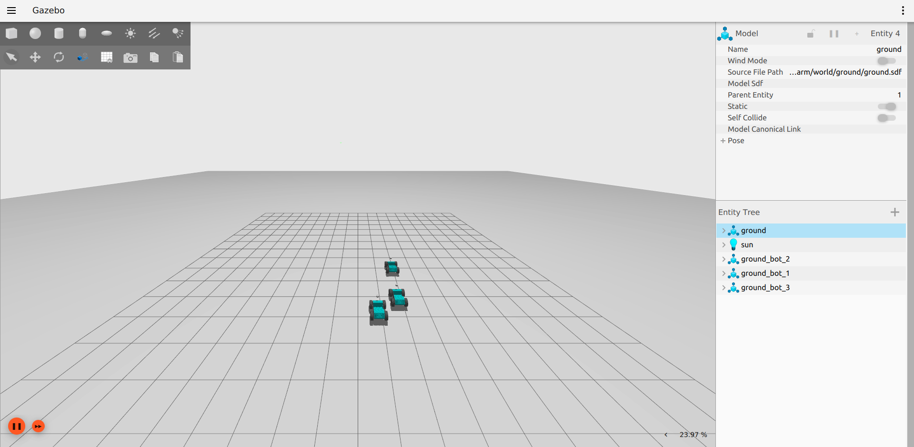
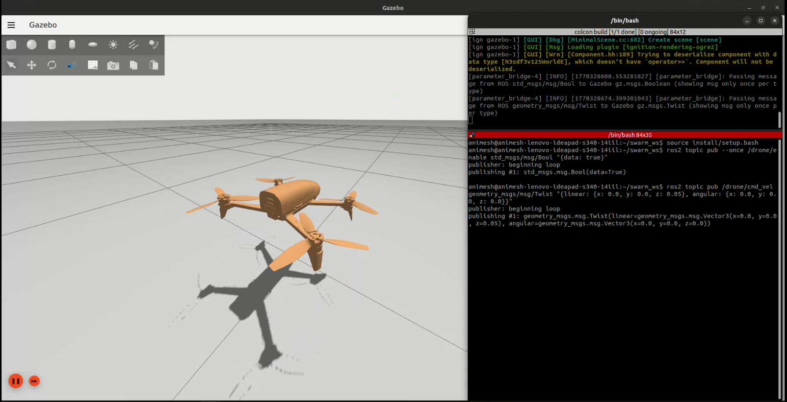

# Swarm Robotics Project

A curiosity-driven project for building digital twins of a heterogeneous swarm of robots to simulate real-world industrial and defense applications. The goal is to convert multi-robot coordination theory into a realistic ROS 2 + Gazebo simulation.

## Overview

This project aims to build a fully functional Gazebo simulation implementing a swarm of heterogeneous robots, including:
- Ground Bots (differential drive)
- UAVs / Drones (quadrotor)
- Ground Bots with end-effectors *(planned)*



Currently, ground bots and drones are actively deployed through a **single unified launch file** that supports any mix of robot types. The setup replicates a **leaderless swarm** in a **communication-constrained environment**, where appropriate job scheduling algorithms select the respective type of bot based on the task at hand.



This project utilises:
- **ROS 2** for communication
- **Gazebo Fortress (Ignition)** for simulation


## Prerequisites

- **ROS 2**: Humble
- **Gazebo**: Fortress (Ignition)
- **ros_gz**: ROS 2 ↔ Gazebo bridge

Ensure that ROS 2 Humble and Gazebo Fortress are correctly installed and sourced on your system.

## Installation

1. **Clone the repository**:
    ```bash
    git clone https://github.com/AnimeshM21/swarm_project.git
    cd swarm_project
    ```

2. **Build the workspace**:
    ```bash
    colcon build
    ```

3. **Source the setup file**:
    ```bash
    source install/setup.bash
    ```

## Usage

The entire project is driven by a **single unified launch file** — `swarm.launch.py` — and a **single teleop node** — `swarm_teleop`. Both support any combination of ground bots and drones via launch arguments.

### Launch the Swarm

```bash
# Default: 3 ground bots, 0 drones
ros2 launch swarm swarm.launch.py

# Custom mix
ros2 launch swarm swarm.launch.py num_bots:=2 num_drones:=1

# Drone only
ros2 launch swarm swarm.launch.py num_bots:=0 num_drones:=1

# Single ground bot
ros2 launch swarm swarm.launch.py num_bots:=1
```

The launch file automatically:
- Spawns all robots at collision-free random positions
- Generates and applies the correct ROS ↔ Gazebo bridge configuration
- Starts the `swarm_teleop` node

### Teleop Controls

Although `swarm_teleop` is launched as part of the launch process, it is best interacted with in a **separate terminal** to capture keyboard inputs properly. 

Simply source and run:
```bash
ros2 run swarm swarm_teleop
```

The teleop node features **dynamic ROS graph auto-discovery**. It will automatically scan for active topics at startup, detect the number of ground bots (`/bot_N/cmd_vel`) and drones (`/drone_N/cmd_vel`), and scale the controls accordingly.

Controls are context-aware — they adapt to whether the active agent is a ground bot or a drone:

| Key | Ground Bot | Drone |
|-----|-----------|-------|
| `1`–`9` | Switch active agent | Switch active agent |
| `W` / `S` | Forward / Backward | Forward / Backward |
| `A` / `D` | Rotate Left / Right | Yaw Left / Right |
| `↑` / `↓` | Forward / Backward | Ascend / Descend |
| `←` / `→` | Rotate Left / Right | Strafe Left / Right |
| `SPACE` | Stop active agent | Hover |
| `0` | **Emergency stop ALL** | **Emergency stop ALL** |
| `X` | Quit | Quit |

## Project Structure

- **launch/**: Contains the unified Python launch file.
- **model/**: Robot description files (XACRO/SDF), made modular based on each aspect of the bot.
- **world/**: Gazebo world files (SDF), including the `swarm_world.sdf` layout.
- **meshes/**: 3D models for robots, primarily STL files.

> **Note on Sensors:** Due to heavy rendering requirements of multiple lidar/depth-cameras with Ogre2 on integrated graphics, sensor system plugins are disabled by default in `swarm_world.sdf` and `robot.xacro` to guarantee high simulation performance/stability. They can be re-enabled by uncommenting the plugin blocks.
